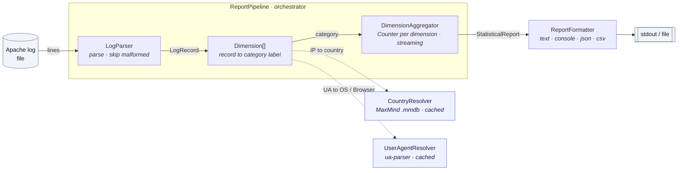
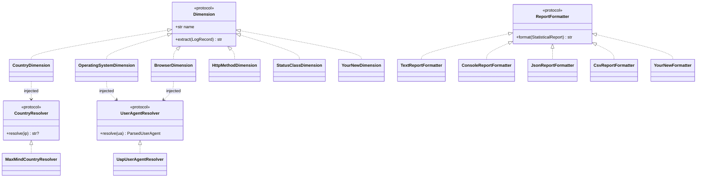

# Design - Apache Log Statistical Reporting Module

* * *

## Background - the problem, at a high level

Every time a browser, app, or bot makes an HTTP request, the web server writes one line to an **access log**. A busy site produces millions of these lines a day; the sample dataset here is 10,000. Each line is dense, machine-oriented text - an IP address, a timestamp, the requested URL, a status code, and a `User-Agent` string - and on its own a single line tells you almost nothing.

The value is in the **aggregate**.

Product, marketing, and engineering teams repeatedly want to answer audience questions from this raw exhaust:

  * **Where are our visitors?** (country - useful for CDN placement, localisation, market prioritisation, fraud/abuse signals)

  * **What are they using?** (operating system and browser - useful for deciding what to QA against, which platforms to support, and spotting bot traffic)

Answering these means turning the raw log into a **statistical report**: for each dimension, what share of requests falls into each category.

Two facts make this non-trivial and shape the whole design:

  1. **The interesting fields are not in the log directly.** "Country" has to be derived from the IP via a geo-IP database; "OS" and "browser" have to be parsed out of the messy, effectively-unbounded space of `User-Agent` strings. Both are best handled by dedicated, well-maintained data sources/libraries rather than hand-rolled rules.

  2. **The questions keep changing.** Today it's country/OS/browser; tomorrow someone wants the breakdown by status code, by URL path, or exported as JSON for a dashboard. A good solution must make _adding a new dimension or output format_ cheap and safe - that, not the arithmetic, is the real engineering challenge (and what the assignment prioritises).

The rest of this document explains the architecture that follows from those two observations.

## High-level architecture

Data flows **one line at a time** (streaming) - a line is parsed, counted, and discarded, so nothing holds all records in memory at once.

Each component's responsibility and its input to output:

Component | Responsibility | Input to Output  
---|---|---  
`LogParser` | Parse a raw line; reject malformed ones | log line to `LogRecord`  
`CountryResolver` | Enrich an IP via GeoIP (cached) | IP to country name  
`UserAgentResolver` | Parse a User-Agent via ua-parser (cached) | UA string to `ParsedUserAgent` (OS / browser)  
`Dimension` | Map a record to **one** category label | `LogRecord` to category string  
`DimensionAggregator` | Streaming frequency counts; sorting; "Other" bucket; percentages | category labels to `StatisticalReport`  
`ReportFormatter` | Serialise the report in a chosen format | `StatisticalReport` to text / console / json / csv string  
`ReportPipeline` | Orchestrator: drive the per-line loop over the stages; count skips; time the run | log lines to `StatisticalReport`  
  
## Key abstractions and interfaces

Everything the core depends on is a structural interface (a `Protocol`), so implementations are decoupled and trivially faked in tests.

The five abstractions, at a glance:

  * **`LogParser`** - turns one raw log line into a typed record, rejecting lines that don't match the expected format.

  * **`CountryResolver`** - resolves a client IP to a country name, or signals "unknown" when the address isn't in the geo database.

  * **`UserAgentResolver`** - parses a User-Agent string into its OS and browser families.

  * **`Dimension`** _(main extension point)_ - maps a record to exactly **one** category label and carries the heading it reports under.

  * **`ReportFormatter`** _(other extension point)_ - serialises a finished report into an output string (text / console / json / csv).

These interfaces are interchangeable **strategies**. The diagram below shows each interface and the concrete implementations that ship today - the dashed arrows are the two seams you extend (a new `Dimension`, a new `ReportFormatter`):

(`YourNewDimension` / `YourNewFormatter` are placeholders for the additive extension points - see **Extensibility** below.)

**Why`Dimension` is the heart of the design.** A dimension answers exactly one question - _"which category does this request fall into?"_ - and returns a single label. The aggregator is completely generic over dimensions: it just keeps a `Counter` per dimension and increments `counter[dimension.extract(record)]`. That is why a new dimension needs **zero** changes anywhere else.

**Why resolvers are separate from dimensions.** The OS and Browser dimensions both derive from the _same_ User-Agent string. If each dimension parsed the UA itself, we would parse every line twice. Instead, a shared `UserAgentResolver` parses each unique UA **once** and caches it; the OS and Browser dimensions just read different fields off the cached result. The same logic applies to GeoIP: client IPs repeat heavily, so lookups are memoised. Both caches are **bounded (LRU)**, not unbounded dicts: a very large log can contain millions of distinct IPs, so an unbounded memo would itself grow `O(distinct IPs)` and become the real memory ceiling - the LRU keeps it `O(cache size)` while still absorbing the heavy repetition. (Single Responsibility: _dimension_ = "what category", _resolver_ = "how to enrich raw data".)

All cross-boundary data is a **Pydantic model** (`LogRecord`, `ParsedUserAgent`, `CategoryShare`, `DimensionStatistics`, `StatisticalReport`, plus `PartialAggregate` for the worker-to-parent merge in parallel mode and `StageTimings` for the per-stage timings) rather than a loose dict - validation at the seams and a single place to evolve the schema.

## Extensibility - adding new dimensions, output formats, etc.

Both requested axes are backed by a small **registry** (a name to factory map), which is the seam the CLI uses for `--dimensions` and `--format`.

**Add a new dimension** (e.g. "Status Class") - _already shipped as a demo_:
    
    
    class StatusClassDimension:
        name = "Status Class"
        def extract(self, record: LogRecord) -> str:
            return "Unknown" if record.status is None else f"{record.status // 100}xx"
    
    DIMENSION_REGISTRY["status"] = lambda country, ua: StatusClassDimension()
    

That is the **entire** change. It is instantly available: `--dimensions status`. (`status` and `method` dimensions ship in the box precisely to prove this.)

**Add a new output format** (e.g. HTML):
    
    
    class HtmlReportFormatter:
        def format(self, report: StatisticalReport) -> str: ...
    
    FORMATTER_REGISTRY["html"] = HtmlReportFormatter
    

Available immediately as `--format html`. No other file changes. (The coloured `console` formatter shipped in exactly this way - one new file plus one registry line.)

**Add a new log format** (e.g. nginx / JSON access logs): implement `LogParser` and inject it into the service - the rest of the pipeline is unaffected.

**Add a new front-end** (e.g. an HTTP API, a notebook, a scheduled job): call `logstats.service` rather than re-wiring anything. `StatisticsReportService` (built once, reused per request) or the one-shot `analyze_log_file` returns a `StatisticalReport`; `report.model_dump()` is JSON-ready, or `render_report(report, fmt)` renders text/console/json/csv. The CLI is just one such front-end - keeping the composition root in the service is what makes this cheap.

## Technology choices and rationale

Choice | Why | Alternatives considered  
---|---|---  
**Python 3.11+** | Concise, great stdlib (`re`, `collections.Counter`, `csv`, `json`), and the richest ecosystem of GeoIP / UA libraries - lets the design patterns show without ceremony. | Go / Rust (faster, but heavier to write and weaker GeoIP/UA library coverage for a focused module).  
**`geoip2` \+ local GeoLite2 `.mmdb`** | The assignment mandates the _downloadable_ DB, not the web API (rate limits). `geoip2` reads the official MaxMind binary format directly; lookups are local and fast. | MaxMind web service (network round-trip + rate limits); IP2Location / hand-rolled CIDR tables (less accurate, more to maintain).  
**`user-agents` (built on `ua-parser`)** | Mature, well-maintained UA parsing with a clean `os.family` / `browser.family` API. _Use a library, don't reinvent UA parsing_ - the long tail of UA strings is enormous. | Hand-rolled regexes (unmaintainable tail); `httpagentparser` / raw `ua-parser` (smaller community or lower-level API).  
**`pydantic`** | Typed, validated, self-documenting models at every boundary instead of dicts. | `dataclasses` / `attrs` (no validation at the seams); plain dicts (untyped, error-prone).  
**`Protocol` (structural typing)** | Interfaces without inheritance boilerplate; fakes in tests need no base class. | `abc.ABC` (forces an inheritance hierarchy on every implementation and fake).  
**`rich`** | Powers the `console` format (coloured, aligned tables with inline bar charts) and handles terminal/TTY detection. _Use a library_ rather than hand-roll ANSI and box-drawing. | Hand-rolled ANSI / `colorama` (manual width and TTY handling); `tabulate` (tables only, no colour or bars).  
**`argparse` \+ `pytest`** | Stdlib CLI; standard test runner. No heavyweight frameworks for a focused module. | `click` / `typer` (extra dependency for a small CLI); `unittest` (more boilerplate than `pytest`).  
  
## Trade-offs and assumptions

  * **Single-threaded by default, multi-process on demand.** One core streams the file line by line, and memory stays bounded - `O(distinct category values)` for the counters plus a fixed-size LRU per resolver, never `O(lines)` - so a single process comfortably handles far more than 10k lines. When you need more throughput, `--workers N` shards the file across worker **processes**.

    * **How sharding works.** The file is cut into line-aligned byte ranges (more shards than workers, so the pool can work-steal stragglers). Each worker runs the ordinary `aggregate()` pass over its slice, and the parent folds the per-shard counts into one report. Counter addition is associative and commutative, so the result is identical no matter where the shard boundaries fall.

    * **Why processes, not threads.** The work is CPU-bound (regex parsing + UA/GeoIP lookups), and CPython's GIL serialises CPU-bound threads - so a thread pool would barely help. Separate processes each get their own interpreter and GIL and run truly in parallel. The cost: workers don't share resolver caches (each warms its own), plus per-process start-up and the overhead of shipping partial counts back to the parent.

    * **The bottleneck we knowingly defer.** The hot path is the per-line CPU cost - the regex and per-record UA/GeoIP resolution - not I/O or memory, which is exactly what spreading lines across cores attacks. We deliberately skip further tuning: per-process caches re-learn repetition, the parent merge is sequential, and the file is neither memory-mapped nor pre-indexed. At this scale none of that is the limiting factor, and the seams (`LogParser`, resolver `Protocol`s, the `aggregate()` + `build_report` split) make it easy to revisit if input size ever makes the per-line cost hurt.

  * **Malformed lines are skipped and counted, not fatal.** A line that fails the parser is dropped and tallied into a skip count surfaced in the run summary; the report is computed over whatever parsed. There is deliberately **no data-quality gate** (e.g. "abort if >X% skipped"): partial results beat failing a run on a few bad lines. A strict mode is an easy future addition, not a current goal.

  * **The hot path trusts the regex and skips per-record validation.** Records are built with `model_construct`, bypassing Pydantic validation, because the anchored regex has already proven the field shapes - re-validating millions of records would be wasted work. The trade-off: validation discipline now lives in the parser, so a future field added to `LogRecord` must be regex-guarded rather than relying on the model to check it.

  * **Percentages use largest-remainder (Hamilton) apportionment.** Shares are rounded so the displayed column sums to exactly `100.00` instead of drifting to `99.99`/`100.01` from independent per-row rounding. The trade-off is that a single category's shown percentage can sit `0.01` off its naive rounding - correct totals are chosen over per-row "purity", which is the right call for a report people read.

  * **IP addresses are PII and handled transiently.** They exist only in memory during a run (in the bounded resolver LRU) and never appear in the output - the tool emits aggregates, not per-visitor records. Assumption: this is audience reporting, not user tracking, so nothing is persisted or logged at IP granularity.

**`Unknown` vs `Other` (deliberately distinct):**

  * **`Unknown`** - a value we could not resolve (IP not in the GeoIP DB, UA unrecognised). It is a real category and sorts by its own frequency, so a large unresolved slice stays visible instead of being buried.

  * **`Other`** - the long tail of known small categories, collapsed into one bucket only when `--top-n` is given, and always placed last.
